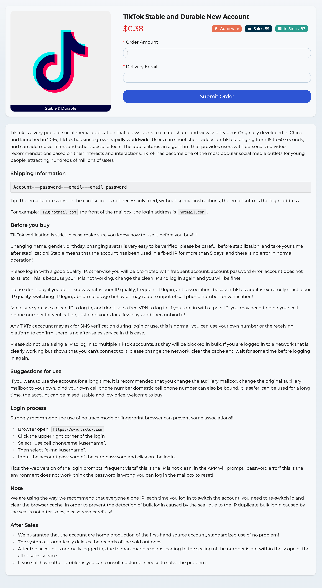

# 2024 Latest Free TikTok Stable and Durable New Account

Website: [https://allshop.vip](https://allshop.vip/?_referrer=ghkdmmz92)



TikTok is a very popular social media application that allows users to create, share, and view short videos.Originally developed in China and launched in 2016, TikTok has since grown rapidly worldwide. Users can shoot short videos on TikTok ranging from 15 to 60 seconds, and can add music, filters and other special effects. The app features an algorithm that provides users with personalized video recommendations based on their interests and interactions.TikTok has become one of the most popular social media outlets for young people, attracting hundreds of millions of users.

##### Shipping Information

```
Account---password---email---email password
```

Tip: The email address inside the card secret is not necessarily fixed, without special instructions, the email suffix is the login address

For example: `123@hotmail.com` the front of the mailbox, the login address is `hotmail.com`.

##### Login process

Strongly recommend the use of no trace mode or fingerprint browser can prevent some associations!!!

- Browser open: `https://www.tiktok.com`
- Click the upper right corner of the login
- Select “Use cell phone/email/username”.
- Then select “e-mail/username”.
- Input the account password of the card password and click on the login.

Tips: the web version of the login prompts “frequent visits” this is the IP is not clean, in the APP will prompt “password error” this is the environment does not work, think the password is wrong you can log in the mailbox to reset!
